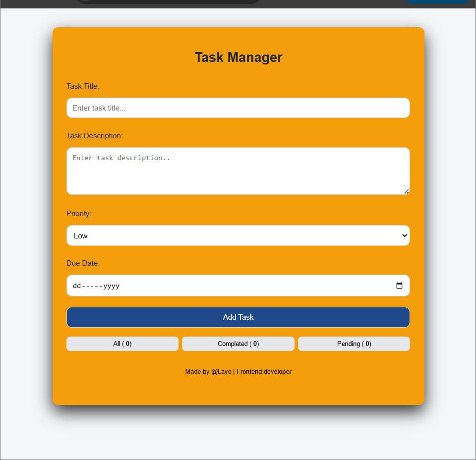

# Task Manager Application

A modern and responsive Task Manager application built with **Object-Oriented Programming (OOP) in JavaScript** to demonstrate clean architecture, state management, and real-world frontend development practices.

---

## Overview

This project was developed to strengthen my understanding of **Object-Oriented Programming (OOP) in JavaScript** by applying concepts such as encapsulation, class-based structure, and method design in a practical application.

The app allows users to create, manage, and track tasks efficiently with a clean and responsive user interface.

---

## Features

- Add new tasks with:
  - Title
  - Description
  - Priority level (Low, Medium, High)
  - Due date

- Mark tasks as completed
- Delete tasks
- Filter tasks:
  - All
  - Completed
  - Pending

- Task counters:
  - Total tasks
  - Completed tasks
  - Pending tasks

- Form validation to prevent empty inputs
- Data persistence using **localStorage**
- Fully responsive design (mobile, tablet, desktop)

---

## Concepts Applied

This project focuses on applying core frontend and JavaScript principles:

- Object-Oriented Programming (OOP)
  - Classes (`Task`, `TaskManager`)
  - Encapsulation (private class fields)
  - Methods and state management

- DOM Manipulation
- Event Handling
- Local Storage (data persistence)
- Responsive UI design
- Clean and maintainable code structure

---

## Project Structure

task-manager
│
├── index.html
├── style.css
├── README.md
├── .prettierrc
└── script.js

---

## How It Works

- Each task is represented as an instance of the `Task` class
- All tasks are managed through the `TaskManager` class
- Tasks are stored in a private array and accessed through class methods
- UI updates are handled through a centralized `updateUI()` function
- Data is saved and loaded from `localStorage` for persistence

---

## Responsive Design

The application is fully responsive and optimized for:

- Mobile devices
- Tablets
- Desktop screens

---

## Tech Stack

- HTML5
- CSS3 (Flexbox, Media Queries)
- Vanilla JavaScript (ES6+, DOM Manipulation, OOP)

## Demo

Live version:  
[Live Demo][https://taskmanageroop.netlify.app/]

## Screenshots

---

## Goals of This Project

- Apply OOP concepts in a real-world scenario
- Improve code structure and maintainability
- Build a user-friendly and interactive interface
- Simulate real frontend development workflows

---

## Future Improvements

- Edit task functionality
- Drag and drop task management
- Dark mode support
- Backend integration (API/database)
- Authentication system

---

## Opportunities

I am currently open to:

- Frontend Developer Internships
- Entry-level Frontend Roles
- Collaboration on real-world projects

If you’re a recruiter or developer looking for a motivated and growth-oriented frontend developer, feel free to connect.

---

## Contact

- Email: owolabinofisat7@gmail.com

---

## Acknowledgements

This project is part of my **#100DaysOfCode journey**, where I consistently build and share my progress while improving my frontend development skills.

---

## License

This project is open-source and available for learning and personal use.
